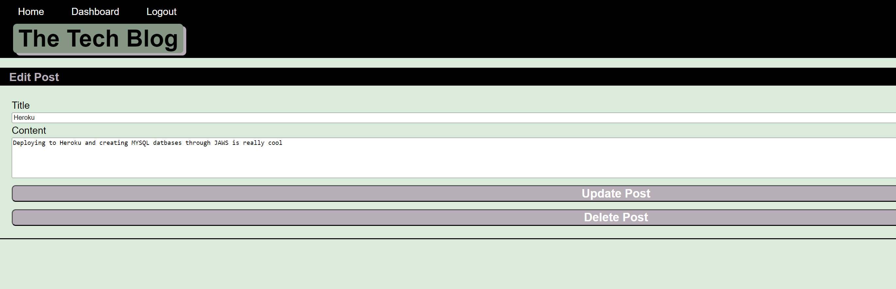
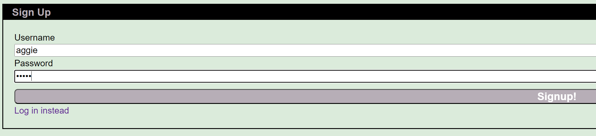
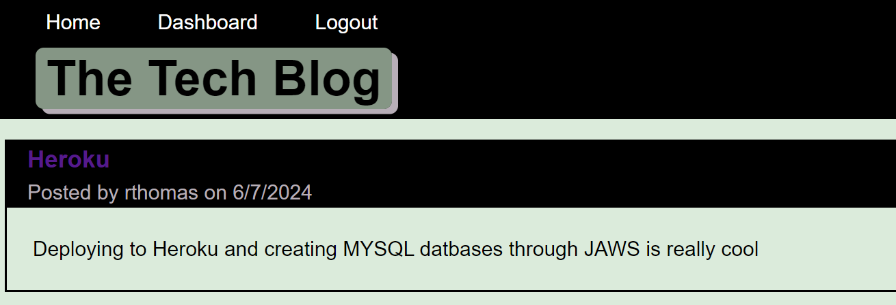
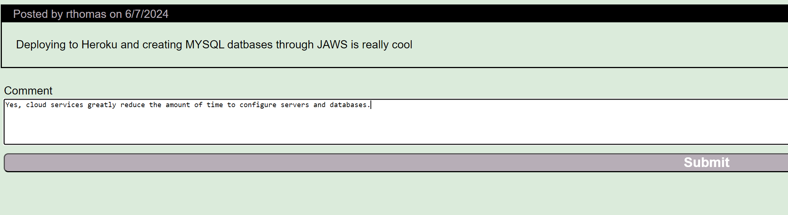
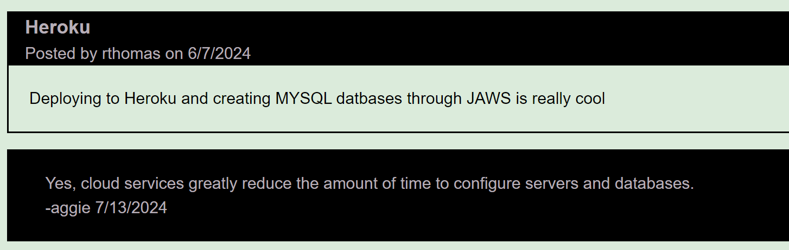
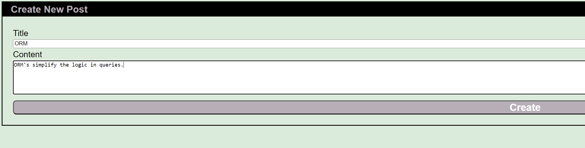
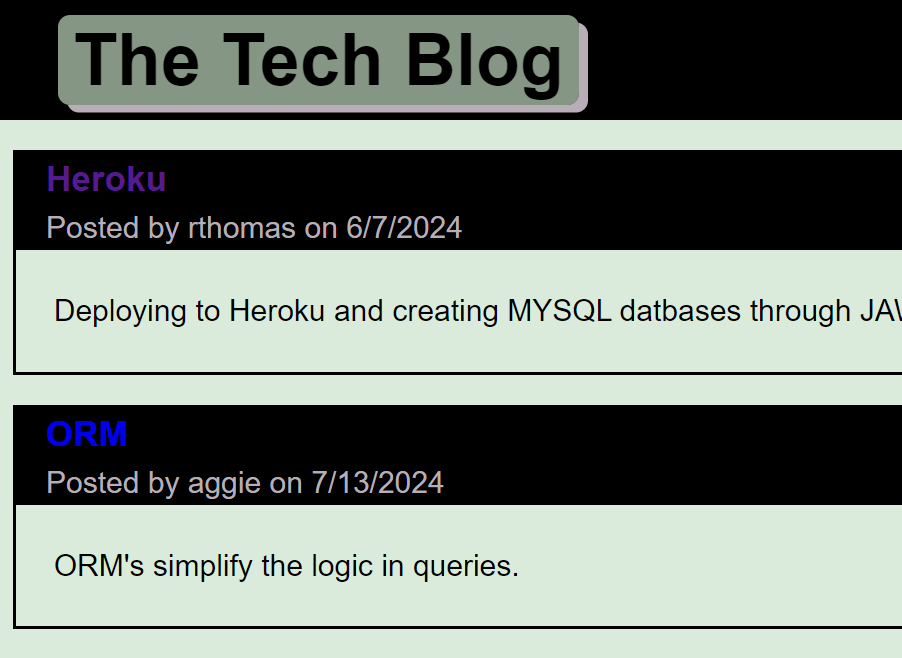
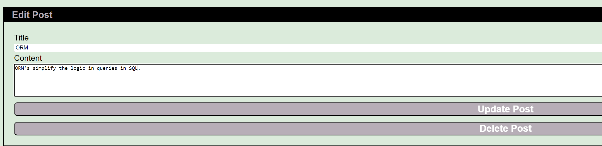

# MVC_Tech_Blog

## Description

MVC Tech Blog uses the Model-View-Controller paradigm to create IT posts and comments from authenticated users. The posts can be created, read, updated, and deleted. Handlebars is used as the template language, Sequelize is used for the Object Relationship Model, and Express is used for session authentication. MYSQL is the backend database and Heroku provides the live URL for the application.

## Installation

N/A

## Usage

Anybody can view the current posts. However, to add posts or comments in the BLOG, a user must signup. Links for Home, the Dashboard, and Login are presented on the menu.

Clicking on the links before logging in or signing up will prompt the user to do so. Upon signup, the credentials are saved for the user and password. After revisiting the site, the same user-password credential will allow access for posts or comments. After a signup or login, the user is displayed with a logout option on the menu bar. The HomePage displays the current posts. The user, the creation date, and the title of the post are displayed.

Clicking on a Blog post presents the title, contents, creators name, and the date created for the post. An option to create a comment for the post is an additional option on the page. The user who created the comment and the date of the comment subsequently are linked to the post.

Clicking on the dashboard option allows the current user to view personal posts or to add new posts. Clicking on adding a new post will prompt entries for a title and content. After clicking on the Create button the title and contents are saved and the site is redirected to an updated Dashboard.

When I am on the dashboard, I am able to click on a post and either update or remove the post.

I have the option to logout. A session timeout will require me to relogin.

GitHub Repository: https://github.com/rethomas67/Work_Day_Scheduler
GitHub page link: https://rethomas67.github.io/Work_Day_Scheduler/
